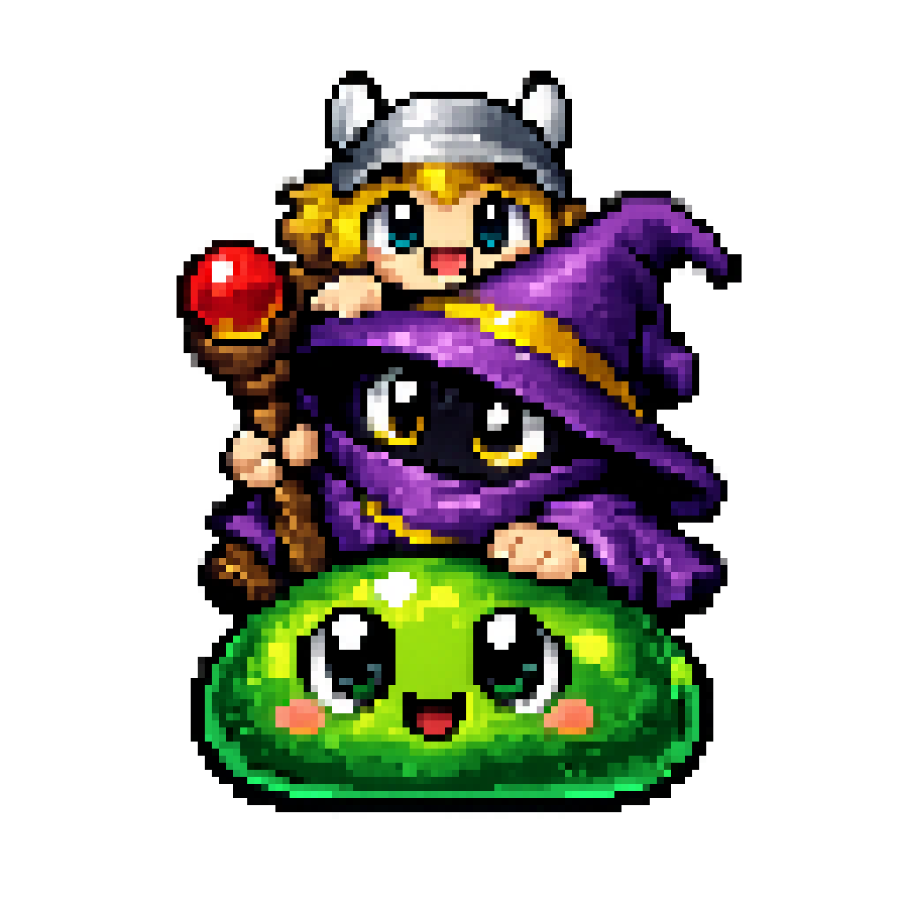
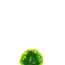
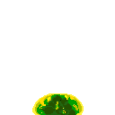
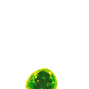
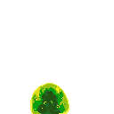
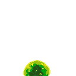
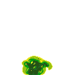

<p align="center">
  
</p>

<h1 align="center">AgentSprites</h1>

<p align="center">
  <strong>Desktop pets that show you what Claude Code is doing</strong>
</p>

<p align="center">
  Animated pixel art companions that live on your screen and react to your Claude Code sessions in real-time.
</p>

---

## What is AgentSprites?

AgentSprites is a macOS menu bar app that gives you adorable animated companions to monitor your [Claude Code](https://github.com/anthropics/claude-code) sessions. Each sprite walks along your screen and changes behavior based on what Claude is doing—working, waiting for input, requesting permissions, or finished with a task.

Think of it as a "desktop pet" that keeps you informed at a glance, without interrupting your flow.

## Features

- **Real-time status** — Sprites visually react to Claude Code's current state
- **Multiple sessions** — Each Claude Code instance gets its own sprite
- **Custom characters** — Create your own character packs with any pixel art
- **Lightweight** — Native Swift app with minimal CPU/memory footprint
- **One-click setup** — Automatic hook installation, no manual configuration

## Installation

Download the latest release from [GitHub Releases](https://github.com/anthropics/agent-sprites/releases) and unzip it.

Since the app isn't signed with an Apple Developer certificate, macOS will block it. To allow it, run:

```bash
xattr -dr com.apple.quarantine ~/Downloads/AgentSprites.app
```

Or go to **System Settings → Privacy & Security**, scroll down, and click **Open Anyway**.

On first launch, the app will prompt to install Claude Code hooks—click **Install** and you're ready to go.

Requires macOS 13+ and [Claude Code](https://github.com/anthropics/claude-code).

## Session States

Your sprite changes animation based on what Claude is doing:

<table>
<tr>
<td align="center"><br><b>Idle</b></td>
<td align="center"><br><b>Working</b></td>
<td align="center"><br><b>Moving</b></td>
<td align="center"><br><b>Waiting for Input</b></td>
<td align="center"><br><b>Waiting for Permission</b></td>
</tr>
<tr>
<td align="center"><br><b>Error</b></td>
<td align="center"><br><b>Done</b></td>
<td align="center"><br><b>Dragging</b></td>
<td align="center"><br><b>Falling</b></td>
<td></td>
</tr>
</table>

## Custom Character Packs

AgentSprites comes with a built-in slime character, but the real fun is creating your own!

### Pack Modes

When you run multiple Claude Code sessions, each gets its own sprite. AgentSprites supports two modes for differentiating them:

- **Hue Rotation** — Single-character packs (like the built-in slime) automatically give each session a unique color by rotating the hue. Great for simple packs with one character.

- **Character Rotation** — Multi-character packs assign a different character to each session. Perfect for packs with multiple distinct sprites (e.g., a set of different creatures).

The mode is determined automatically based on your pack structure: use `character.json` for hue rotation, or multiple `{name}.json` files for character rotation.

### Creating a Character Pack

1. Create a folder in `~/Library/Application Support/AgentSprites/Characters/`
2. Add your sprite sheet PNGs (horizontal strips of animation frames)
3. Create a `character.json` describing your animations

Example `character.json`:

```json
{
  "id": "my_character",
  "name": "My Character",
  "frameSize": [64, 64],
  "scale": 2.0,
  "defaultFps": 8,
  "animations": {
    "idle": { "file": "idle.png", "frames": 8 },
    "walk": { "file": "walk.png", "frames": 8 },
    "hurt": { "file": "hurt.png", "frames": 6 },
    "attack": { "file": "attack.png", "frames": 4 }
  },
  "states": {
    "idle": "idle",
    "working": "walk",
    "moving": "walk",
    "waitingForInput": "idle",
    "waitingForPermission": "hurt",
    "error": "hurt",
    "done": "attack",
    "dragging": "walk",
    "falling": "idle"
  }
}
```

See `CharacterPacks/README.md` for the full format specification.

## How It Works

AgentSprites uses Claude Code's [hooks system](https://docs.anthropic.com/en/docs/claude-code/hooks) to receive events:

```
┌─────────────────┐     stdin JSON       ┌─────────────────┐
│  Claude Code    │ ──────────────────▶  │ agentsprites-cli│
│    Hooks        │                      │ (bundled in app)│
└─────────────────┘                      └────────┬────────┘
                                                  │ Distributed
                                                  │ Notification
                                                  ▼
                                         ┌─────────────────┐
                                         │ AgentSprites.app│
                                         │   (SwiftUI)     │
                                         └─────────────────┘
```

The CLI is bundled inside the app—no separate installation needed.

## Development

```bash
# Build
make build

# Run (builds, bundles, and opens)
make run

# Lint & format
make lint
make format

# Run tests
swift test
```

## Acknowledgments

- Inspired by [peon-ping](https://github.com/nicekiwi/peon-ping)

## License

MIT
